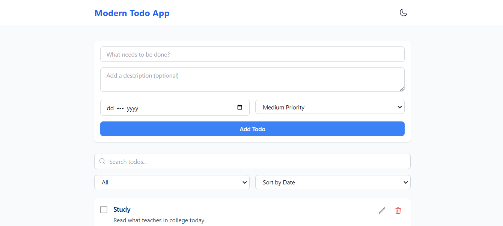

# Todo List Application

A simple yet powerful **Todo List Application** built with **React** and **Tailwind CSS**. It provides essential features to manage your daily tasks efficiently with a clean and responsive user interface.

---

## 🚀 Features

1. **Dark/Light Theme**  
   - Toggle between dark and light modes.  
   - Theme preference is saved in local storage for persistence across sessions.

2. **Persistent Storage**  
   - Todos are stored in local storage, so they remain intact even after refreshing the page.

3. **Task Management**  
   - Add todos with a description, due date, and priority (Low, Medium, High).  
   - Edit or delete existing todos.  

4. **Filtering & Sorting**  
   - Sort todos by priority or date added.  
   - Filter tasks as:
     - **Completed**
     - **Incomplete**
     - **All**

5. **Search Functionality**  
   - Quickly search through todos using the search bar.

6. **Intuitive Design**  
   - Responsive and minimalistic design using Tailwind CSS.  
   - Optimized for a seamless user experience.

---

## 🛠️ Technologies Used

- **React.js**  
- **Tailwind CSS**  
- **JavaScript**  
- **Local Storage** for data persistence

---

## 📸 Screenshots

  

---

## 🔧 How to Run the Project

1. Clone the repository:  
   ```bash
   git clone https://github.com/06-abhishek/modern-todo-app.git
   cd modern-todo-app
   ```

2. Install dependencies:  
   ```bash
   npm install
   ```

3. Start the development server:  
   ```bash
   npm run dev
   ```

4. Open the app in your browser at:  
   ```
   http://localhost:5173
   ```

---

## 🌟 Features to Add in Future

- Integration with a backend for multi-user support.  
- Push notifications for task reminders.  
- Drag-and-drop functionality to reorder tasks.

---

## 🤝 Contributing

Contributions are welcome! Feel free to open an issue or submit a pull request.  

---

## 📄 License

This project is open source and available under the [MIT License](LICENSE).

---

## 🙌 Acknowledgments

- **React.js** and **Tailwind CSS** for their powerful tools.
- Thanks to the open-source community for inspiration and guidance.

---

Made with ❤️ by [Abhishek Patil](https://github.com/06-abhishek/)
